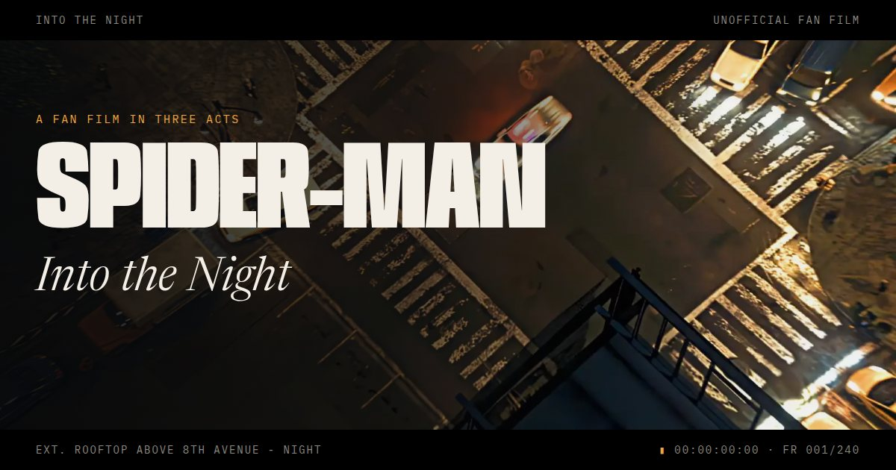

# Into the Night



An unofficial Spider-Man fan film in three acts, played by scrolling through
240 frames above Eighth Avenue, followed by the morning edition of the
Daily Bugle.

**Live:** https://spiderman-story.vercel.app/

## What's on the page

- **The film.** A sticky, letterboxed stage plays the footage by scroll
  position. Narration appears as subtitles, each act opens with a title card,
  and the lower letterbox is a player bar: screenplay slug line, a reel you
  can click, drag or drive with the keyboard (arrows, Page Up/Down, Home/End),
  a buffer strip that fills in as frames arrive, and a 24 fps timecode.
- **Time remapping.** `data-remap` on `.film` maps scroll position to frame
  number piecewise, so the footage slows down where there is more to read.
- **Sound (optional).** City rumble, wind that follows your scroll speed, a
  distant siren and a spider-sense tone, all synthesized with the Web Audio
  API. Nothing is downloaded.
- **Reading mode.** The same story as stills and text. It is the default with
  `prefers-reduced-motion` or Save-Data, the fallback without JavaScript, and a
  button in the top bar for everyone else (`?mode=read` / `?mode=film` also work).
- **The Daily Bugle.** A tabloid front page on newsprint: a halftone photo,
  J. Jonah Jameson's editorial, the original Sinister Six as comic panels, and
  a timeline from *Amazing Fantasy* #15 onward. The dateline, volume number and
  "years on the beat" are computed from today's date.

## How it's built

No framework, no build step, no runtime dependencies. Plain HTML, CSS and ES
modules.

```
index.html          markup for both modes; the <head> script picks the mode
css/site.css        tokens, reading mode, film mode, the Bugle
js/main.js          boot, mode switching, sound button, dateline
js/film.js          scroll → progress → frame, cues, HUD, seeking
js/frames.js        frame loading and the decoded-frame budget
js/sound.js         generative sound
frames/v1/d/        240 × 1600×900 WebP, landscape screens (24 MB)
frames/v1/m/        240 × 608×1080 WebP, portrait screens (11 MB)
img/, og.jpg, favicon.svg, apple-touch-icon.png
tools/              offline builders for the frames and images (not deployed)
vercel.json         caching and security headers
```

### Performance notes

- The frames were 240 PNGs totalling 491 MB. They are now WebP, 35 MB for both
  sets together, and a visitor downloads only one set (24 MB on a laptop, 11 MB
  on a phone).
- The first picture needs one frame (about 60–140 KB). Everything else streams
  in the background: frames just ahead of the playhead first, then every 8th
  frame across the film, then the gaps.
- Compressed frames stay in memory as Blobs; only a window of decoded
  `ImageBitmap`s around the playhead is kept (about 160 MB budget, 96 MB on
  low-memory devices), and the rest are closed. Decoding all 240 frames at
  full size would take about 2 GB.
- Phones get a portrait crop of each frame that follows the subject (the police
  car, then the lens, then the hand on the ledge) instead of a fixed centre crop.
- The render loop only runs while the picture is catching up with the scroll.
- `vercel.json` marks `/frames/*` as immutable for a year. If you change any
  frame, write the new set to `frames/v2/` and update the path in `js/film.js`.

## Running locally

Any static server works:

```bash
python3 -m http.server 3000
# or
npx serve .
```

Then open http://localhost:3000.

## Rebuilding the frames and images

The original 1920×1080 PNGs were removed from the working tree to keep the
deploy small. They are still in git history:

```bash
git checkout e294c9f -- images/
cd tools
npm install
node build-frames.mjs ../images       # writes frames/v1/{d,m}
npx playwright install chromium
node build-images.mjs                 # halftone photo, share card, icons
```

## To do

- Credit the source of the footage in the colophon (`index.html`, "About this
  page") and here.

## Disclaimer

*Into the Night* is an unofficial, non-commercial fan project. Spider-Man, the
Daily Bugle and all related characters are trademarks of Marvel. This site is
not affiliated with, sponsored or endorsed by Marvel or The Walt Disney
Company. The footage belongs to its owners and is used here for non-commercial
fan purposes. The narration and the Bugle stories are original fan writing.
