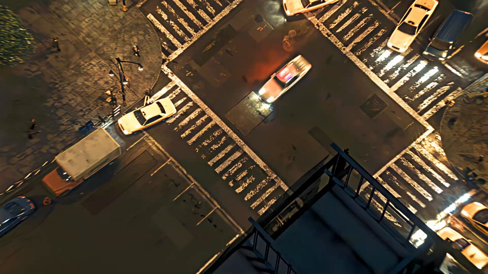

# Spider-Man: Into the Night



**An immersive, scroll-driven cinematic journey through Spider-Man's neon-drenched New York.**

Dive into the dark, neon-lit streets of Marvel's New York. Experience Spider-Man's story through an interactive, scroll-driven cinematic canvas engine enhanced with cutting-edge front-end effects like 3D glassmorphism tilt cards, interactive particle webs, and magnetic UI elements.

[**Live Demo**](https://spiderman-story.vercel.app/)

---

## ✨ Features

*   **Cinematic Scroll Engine:** Scrubs through a sequence of 240 high-resolution frames mapped to your scroll progress using GSAP ScrollTrigger and HTML5 `<canvas>`.
*   **Asynchronous Image Preloading:** A custom preloader that batches image decoding off the main thread using `createImageBitmap` for buttery-smooth performance. Keyframes load first to ensure fast interactivity.
*   **Spider-Sense Particle Web:** A reactive, secondary `<canvas>` overlay where floating particles connect to form a spider web that reaches out to track your mouse cursor.
*   **3D Glassmorphism Cards:** Floating story panels feature a frosted glass effect and use perspective math to tilt dynamically toward the user's mouse.
*   **Glitch Typography:** CSS-driven RGB split and glitch animations on the hero title.
*   **Reactive Mouse Follower:** A soft, glowing cursor follower that lerps smoothly and intensifies over interactive elements.
*   **Magnetic Buttons:** Calls-to-action that subtly pull toward your cursor on hover, creating a tactile "pull" feel.
*   **Animated Statistics Counters:** Numbers that count up dynamically as you scroll them into view.
*   **Immersive Audio/Visual Touches:** Film grain overlays, cinematic color grading, and dynamic vignette effects driven purely by CSS.

---

## 🛠️ Tech Stack

*   **HTML5** (Semantic structure, `<canvas>`)
*   **CSS3** (Custom Properties, Grid/Flexbox, Keyframe Animations, Glassmorphism)
*   **Vanilla JavaScript** (ES6+)
*   **GSAP (GreenSock Animation Platform)**
    *   Core Engine
    *   ScrollTrigger Plugin
    *   ScrollTo Plugin

---

## 🏗️ Architecture

The core animation engine (`script.js`) is divided into several sub-systems:

1.  **Preloader:** Batches image caching with a progress radar. Prioritizes the first few frames for an instant reveal, then loads keyframes, and finally fills in the gaps.
2.  **Canvas Engine:** Draws frames with "object-fit: cover" math and supports retina device pixel ratios (DPR).
3.  **Scroll Binding:** GSAP ScrollTrigger maps scroll progress to the frame sequence (0 → 239).
4.  **Panel System:** Story panels use `data-appear` and `data-disappear` attributes to drive opacity and translation via scroll progress.
5.  **Web Particles:** A standalone particle system where connected dots react to the mouse cursor.
6.  **Mouse Tracker:** Sets global CSS custom properties (`--mouse-x/y`) for reactive elements and drives the follower blob.
7.  **3D Card Tilt:** Cards rotate toward the cursor on hover, featuring a dynamic glare highlight.
8.  **Magnetic Buttons:** Buttons shift toward the cursor using distance-based math.

---

## 🚀 Running Locally

To run this project locally, you don't need any complex build tools. You just need a local web server to bypass CORS restrictions when loading the images onto the canvas.

1.  **Clone the repository:**
    ```bash
    git clone <your-repo-url>
    cd spiderman-into-the-night
    ```

2.  **Serve the files:**
    You can use any simple HTTP server. For example, using Python or Node.js:
    
    *Using Python 3:*
    ```bash
    python -m http.server 3000
    ```
    
    *Using Node.js (npx):*
    ```bash
    npx serve .
    ```

3.  **Open your browser:**
    Navigate to `http://localhost:3000` (or whichever port your server is using).

---

## 📝 Credits & Disclaimer

*   **Design & Development:** Inspired by modern awwwards-winning scroll experiences.
*   **Fictional Author:** "Marvel Narrative Labs" (Concept only).
*   **Disclaimer:** This is a fan-made, non-commercial prototype. Spider-Man and related characters/assets are property of Marvel Entertainment / Disney. No copyright infringement is intended.
